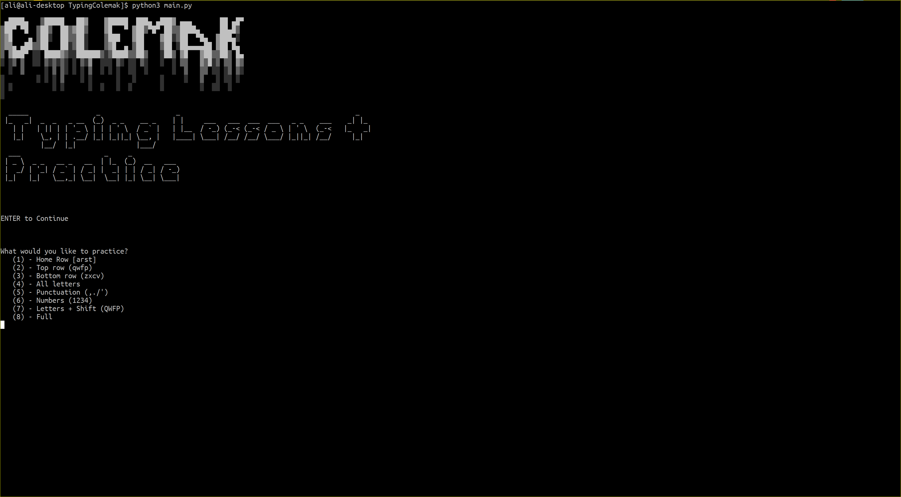

# Introduction 
This is a terminal program written in python made for learning and practicing colemak.

 

# What is colemak
Colemak is a modern alternative to the QWERTY and Dvorak layouts, designed for efficient and ergonomic touch typing in English. Learn more about it at https://colemak.com/

# Running TypingColemak
Simply git clone this repo 

`git clone https://github.com/Mcguy215/TypingColemak.git`

then run main.py

`python3 main.py`
